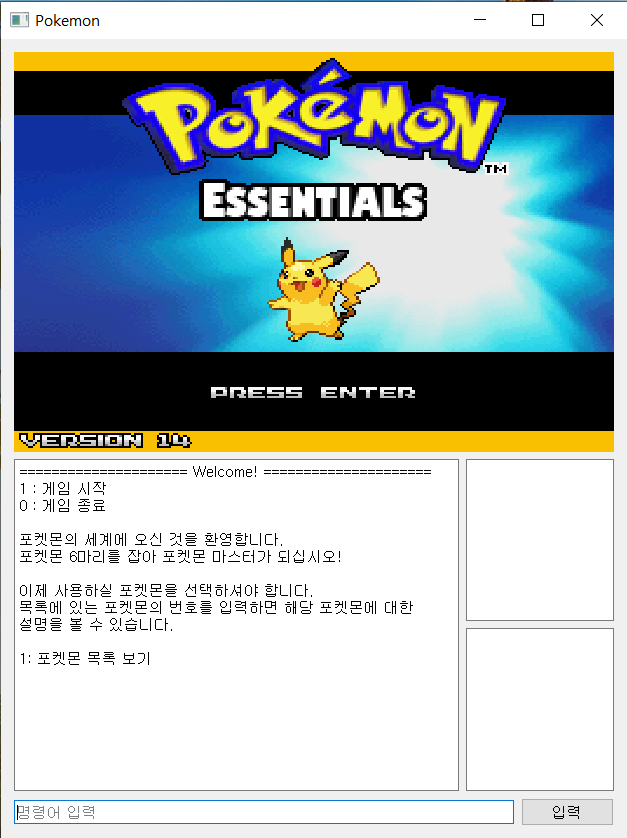
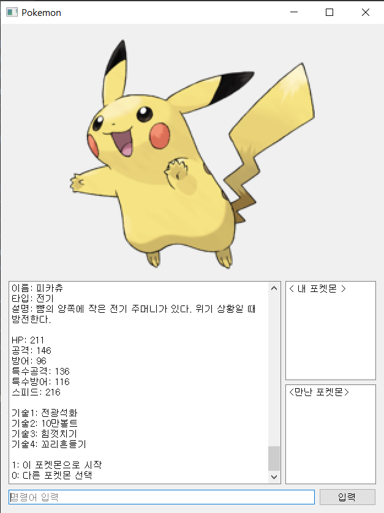

# Pokemon Game (Python)

## Introducton
파이썬을 처음 공부할 때 연습용으로 만든 포켓몬 게임입니다.
자신의 포켓몬 한 마리를 선택하면 게임이 시작되며, 랜덤으로 야생 포켓몬을 만나게 됩니다.
야생 포켓몬을 만나면 싸우거나, 도망치거나, 몬스터볼을 던져서 잡을 수 있습니다.
뒤로 갈수록 강한 포켓몬이 나타나며, 포켓몬 5마리를 잡으면 엔딩을 볼 수 있습니다.
그 전에 내 포켓몬이 모두 쓰러지면 게임은 끝나게 됩니다.
포켓몬의 능력치, 데미지 계산, 포획 확률 등은 실제 포켓몬 게임에서 사용하는 알고리즘을 구현했습니다.
이 게임에는 1세대 포켓몬(1번~151번)만 등장합니다.

## Requirements
Python 3.7 or Python 3.8

## Installation
```shell
pip install --upgrade --user pyqtwebengine==5.12
pip install --upgrade --user pyqt5==5.12
```

## Usage
```shell
python pockemon_main.py
```

<br />
<br />

<p align="center">
  
   
</p>
